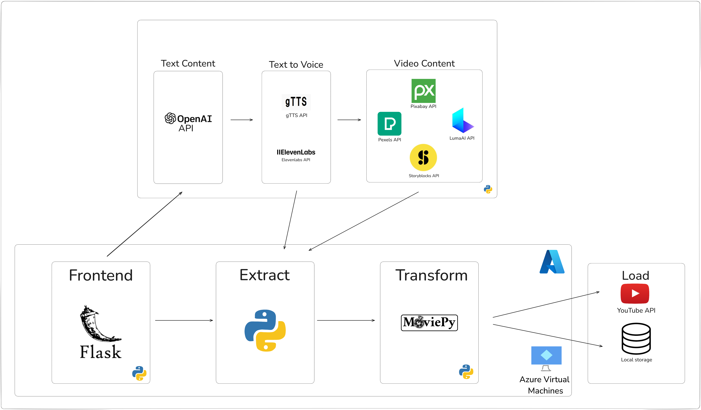
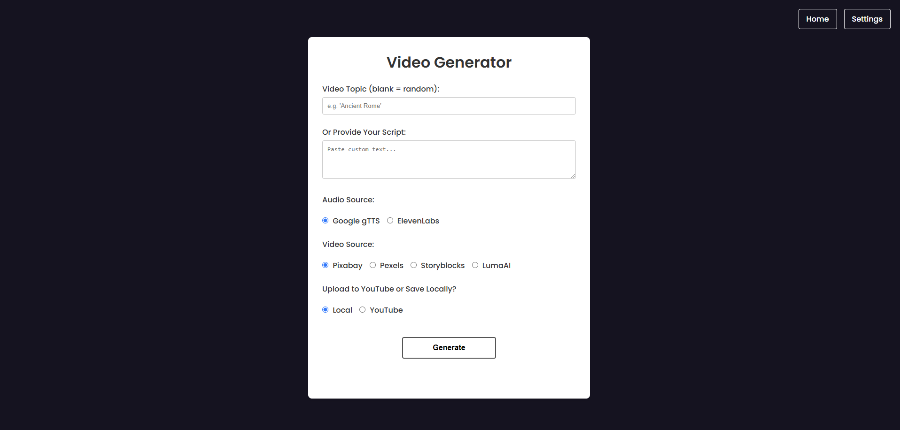

# Content Creation Automation App 
#### Video Content Generation and Upload Tool

This application is a Flask-based web platform designed to streamline the creation and management of video content. It integrates various AI and media APIs to automate the process of generating scripts, audio, and video, as well as uploading the final content to YouTube or making it available for download.

## Key Features

- **Script Generation:** Generate engaging video scripts using OpenAI's GPT models.
- **Audio Synthesis:** Create voiceovers using:
  - Google Text-to-Speech (gTTS)
  - ElevenLabs API
- **Video Assembly:** Combine audio with video clips sourced from:
  - Pixabay
  - Pexels
  - Storyblocks
  - LumaAI
- **YouTube Upload:** Automatically upload generated videos to a YouTube channel.
- **User-Friendly Interface:** Easily configure API keys and customize video generation preferences through a web-based UI.
- **File Management:** Temporary files are managed and auto-deleted for efficiency.

## Flowchart of the Process

Below is a visual representation of the process flow.



## How It Works

1. **Input:** Provide a topic or script and choose preferences for audio source, video source, and upload options.
2. **Processing:**
   - Generate scripts and titles using OpenAI APIs.
   - Create audio files for the scripts.
   - Fetch relevant video clips from the selected source.
   - Combine audio and video into a final video file.
3. **Output:** Download the final video or upload it directly to YouTube.


## Prerequisites
* Python 3.6+ installed on your machine.
* Git installed for version control.

## Setup
1. Clone the Repository
```bash
git clone https://github.com/JohanTokarskij/content_creation_automation_app
cd https://github.com/JohanTokarskij/content_creation_automation_app
```

2. Create a Virtual Environment
It's recommended to use a virtual environment to manage your project's dependencies.

```bash
python3 -m venv venv
```

3. Activate the Virtual Environment
Activate the virtual environment using the appropriate command for your operating system.

On Windows:
```bash
venv\Scripts\activate
```

On Linux and macOS:
```bash
source venv/bin/activate
```

4. Install Dependencies
Install the required Python packages using requirements.txt.

```bash
pip install -r requirements.txt
```

5. Download FFMPEG binaries
Download FFMPEG binaries from `https://ffbinaries.com/downloads`:
- for Windows download ffmpeg.exe and place it inside `ffmpeg_bin/windows` of the working directory
- for Linux download ffmpeg and place it inside `ffmpeg/linux` of the working directory


## Run the Application
Start the Flask application by running:

```bash
python app.py
```

## Access the Application
Open your web browser and navigate to `http://127.0.0.1:5000/` to use the app.


## Setup API Keys

In order to run the application, you need to obtain API keys from the following services:

- [OpenAI API](https://platform.openai.com/docs/overview/)    
- [ElevenLabs API](https://elevenlabs.io/docs/api-reference/introduction/)  
- [Pixabay API](https://pixabay.com/api/docs/)  
- [Pexels API](https://www.pexels.com/api/)  
- [Storyblocks API](https://www.storyblocks.com/resources/business-solutions/api/)  
- [Luma AI API](https://docs.lumalabs.ai/docs/api/)    

### How to Use API Keys

1. Navigate to the **Settings** page in the application.
2. Paste your API keys into the corresponding fields for each service.

**Important:** API keys are not stored permanently. They are temporarily held in the session and will expire when the session ends or when the server restarts. Ensure to re-enter them as needed.

### YouTube OAuth Setup
**Obtain `client_secret.json`:**
1. Go to the [Google Cloud Console](https://console.cloud.google.com/).
2. Create a new project or select an existing one.
3. Navigate to **APIs & Services** > **Credentials**.
4. Click on **Create Credentials** > **OAuth client ID**.
5. Choose **Web application** and set the appropriate authorized redirect URIs (e.g., `http://localhost:5000/`).
6. Download the `client_secret.json` file.

**Setup `client_secret.json`:**
1. In the **Settings** page of the application, locate the YouTube section.
2. Paste the content of the `client_secret.json` file into the designated YouTube section.

**Authorize YouTube:**
1. After pasting the content of `client_secret.json`, click on the **Generate Authorization URL** button.
2. You will be redirected to Google's OAuth consent screen. Log in and grant the necessary permissions.
3. You will receive an authorization code.
4. Paste the authorization code back into the application when prompted.
5. Press **Submit Authorization Code**.
6. Click on **Save Settings** to finalize the setup.

## Deployment to Azure Virtual Machine

To deploy the application on an Azure Virtual Machine (VM), follow these steps:

1. **Set Up the VM:**
   - Create an Azure VM with a Linux or Windows image, depending on your preference.
   - Install Python and necessary dependencies (`pip`, `virtualenv`, etc.) on the VM.

2. **Clone the Application:**
   - SSH into your VM and clone the application repository using Git.
   - Set up a Python virtual environment and install the required dependencies using `pip install -r requirements.txt`.

3. **Expose Port 5000:**
   - Ensure port 5000 is open in the VM's network security group (NSG) rules. Add an inbound rule to allow traffic on port 5000.

4. **Run the Application:**
   - Start the Flask application by running `python app.py`. By default, Flask will run on port 5000.

5. **Access the Application:**
   - Use the VM's public IP address and port 5000 (e.g., `http://<VM-IP>:5000`) to access the application in a web browser.

By exposing port 5000, users can interact with the application from their local machines. For production deployments, consider using a reverse proxy (e.g., Nginx) for enhanced performance and security.
